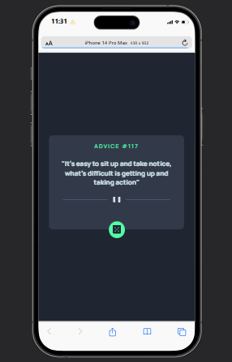

# 🎲 App Gerador de Conselhos

Um aplicativo simples que consome a [Advice Slip API](https://api.adviceslip.com/) com *Fetch* para gerar conselhos aleatórios de forma interativa.


## 🚀 Funcionalidades
- Gera conselhos aleatórios ao clicar no botão ou atualizar a página.
- Responsivo para **desktop** e **mobile**.
- Design moderno com cores em **neon green**.
- Acessibilidade básica implementada (`alt`, `aria-label`).

---

## 🛠️ Tecnologias


---

## 🔧 Ferramentas utilizadas


---

## 🖼️ Layouts

| 💻 Desktop | 🔵 Estado Ativo | 📲 Mobile |
|------------|----------------|-----------|
| |  |  |

---

> 🌐 [Deploy do Projeto](#) 

[](https://cledeocirmarafao.github.io/app-gerador-de-conselhos/)

> 🖥️ [Hospedagem](#)


---

## 💻 Como Rodar o Projeto Localmente

```bash
# Clone o repositório
git clone https://github.com/cledeocirmarafao/app-gerador-de-conselhos.git

# Acesse a pasta do projeto
cd app-gerador-de-conselhos

# Abra o VSCODE
code .

# Abra no navegador
open index.html   # Mac/Linux
start index.html  # Windows

# Se preferir, instale o *Live Server* para visualizar o projeto no navegador
```
---

### ✨ Autor

**Cledeocir Marafão** — ``Desenvolvedor Frontend``

### 📬 Contato

<div align="center">

> Se quiser conversar sobre o projeto ou tecnologia, entre em contato comigo:

  <a href="https://github.com/cledeocirmarafao" target="_blank">
    
  </a>
  <a href="https://www.linkedin.com/in/cledeocir-maraf%C3%A3o-267768193/" target="_blank">
    
  </a>
  <a href="https://www.frontendmentor.io/profile/cledeocirmarafao" target="_blank">
    
  </a>
</div>


## 📄 Licença
Este projeto é de código aberto e está licenciado sob a licença **[MIT](https://opensource.org/license/mit)**.